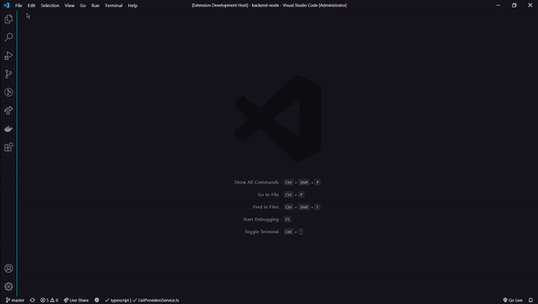

A minimalist dark theme with light blue details focusing on comfort while coding, using the color `Eigengrau` as main color for this theme.

 - Eigengrau is the color known as dark light, or brain gray, is the uniform dark gray background that many people report seeing in the absence of light.

Color for the text is inspired in [Dracula](https://github.com/dracula) and [Dracula-text-only](https://github.com/LucasSonego/dracula-text-only) colors.

